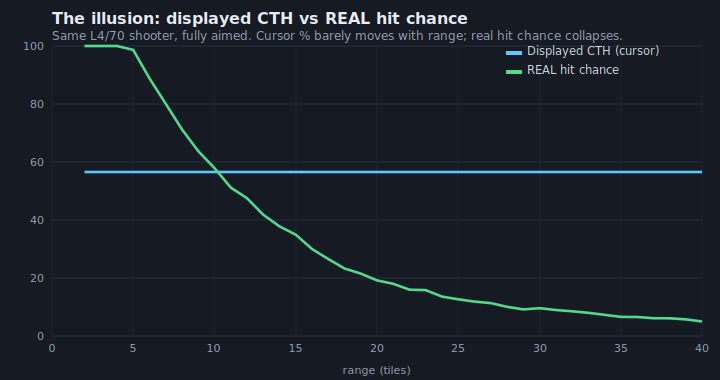
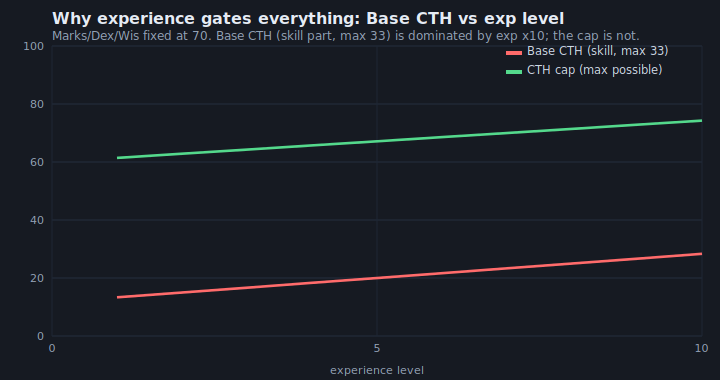
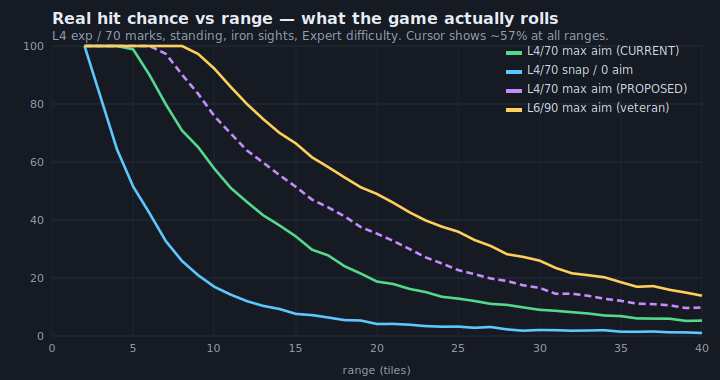

# Jagged Alliance 2 v1.13 — Understanding & Tuning the New Chance‑To‑Hit (NCTH) System

*A source‑grounded analysis of HEADROCK's NCTH shooting model, why low‑level mercs "can't hit anything", and exactly which knobs to turn.*

Prepared from the actual mod source (`source/Tactical/Weapons.cpp`, `source/Tactical/LOS.cpp`, `source/Ja2/GameSettings.cpp`) and the live tuning files (`gamedir/Data-1.13/CTHConstants.ini`, `Ja2_Options.INI`, `DifficultySettings.xml`). Every formula below was read from the code, numerically reproduced, and cross‑checked by an adversarial review pass.

**Companion files in this folder**
- **`index.html`** — an interactive calculator. Open it in any browser (no install). Move the sliders, watch the real hit‑chance curves move. This is the "let's tune it together" tool.
- `chart1_realhit.svg`, `chart2_divergence.svg`, `chart3_base_vs_exp.svg` — the static charts used below.

---

## 0. TL;DR

1. **The complaint is real and it is mostly a geometry problem, not a "bad stats" problem.** A level‑4 / 70‑marksmanship merc with a standing assault rifle shows roughly **"57%"** on the cursor at all ranges, but the number the cursor shows is **not** the chance to hit. The real chance — validated by simulating the exact code — is about **57% at 10 tiles, 20% at 20 tiles, 9% at 30 tiles**, and their *snap* (unaimed) shot is **~5–17%** at any range. That is the "can't hit anything" experience.
2. **Two independent things gate low‑level mercs:** (a) **Base CTH is experience‑dominated** — the formula multiplies experience by 10 *and* weights it ×3, so a low‑level merc's unaimed shot is worthless regardless of marksmanship; (b) **the cursor % feeds a widening cone of fire**, and the chance of a bullet landing on a man‑sized target falls off roughly as *1 / (range²)*, so aimed shots collapse with distance even though the displayed % barely moves.
3. **⚠️ Your live game folder currently has `NCTH = FALSE`** (`gamedir/Data-1.13/Ja2_Options.INI:1737`) — i.e. it is set to run the **old** system (OCTH). Every tuning value in `CTHConstants.ini` only does anything when **`NCTH = TRUE`**. Confirm which system you actually play before tuning (see §1).
4. **Highest‑leverage, low‑risk fixes** (details in §6–7): raise **`IRON_SIGHT_PERFORMANCE_BONUS`**, lower **`DEGREES_MAXIMUM_APERTURE`** a little, lower **`IRON_SIGHTS_MAX_APERTURE_MODIFIER`** toward 2.0, rebalance **`BASE_EXP` down / `BASE_MARKS` up**, and lower **`MAX_BULLET_DEV`**. **Do *not* lower `NORMAL_SHOOTING_DISTANCE`** — it is a false lever for iron sights and actively hurts (§6).

---

## 1. ⚠️ First things first: OCTH vs NCTH (don't tune the wrong system)

JA2 1.13 ships **two completely different** chance‑to‑hit systems, chosen by one switch:

```
Ja2_Options.INI → [Tactical Gameplay Settings] → NCTH = TRUE|FALSE
```
Read into `gGameExternalOptions.fUseNCTH`; `UsingNewCTHSystem()` returns it (`GameSettings.cpp:122`). **In your current `Data-1.13` folder it is `FALSE`.** If that is really how you play, none of the `CTHConstants.ini` values are in effect and the tuning below won't change anything until you set it to `TRUE`.

| | **OCTH** (old / classic) | **NCTH** (new / HEADROCK "HAM4") |
|---|---|---|
| What the % means | A literal probability. The engine rolls `PreRandom(100)`; **hit if roll < CTH** (`Weapons.cpp:3473`). | **Only an estimate of how well the muzzle points.** There is *no* roll‑under. |
| How a miss happens | On a roll‑*over* the bullet is deflected; amount scales with `sHitBy` (how badly you missed). A *hit* goes dead‑centre. | **Every** shot is a random draw inside a "cone of fire". Whether it lands on the target is pure geometry. |
| Tuned by | The big additive `+/-` modifier list inside `CalcChanceToHitGun` and the `[CTH]` INI options. | **`CTHConstants.ini`** (aperture, base/aim weights, recoil) + a few `Ja2_Options` keys. |
| `CTHConstants.ini` used? | **Mostly ignored.** Aperture, scope‑effectiveness, iron‑sight bonus, base/aim weights = **NCTH‑only**. | Yes — this is *the* NCTH tuning file. |

**Takeaway:** everything in this report is about **NCTH**. The two systems share almost no tuning surface, so a value that matters under NCTH (e.g. `DEGREES_MAXIMUM_APERTURE`) does nothing under OCTH, and vice‑versa. This is the trap to avoid.

---

## 2. How NCTH actually works (the whole pipeline)

NCTH replaces "roll a die against a %" with "**simulate where the muzzle is pointing and fly the bullet there**". The displayed % is just an input to that simulation.

```
                        ┌─────────────────────────────────────────────┐
   skills, gun,         │  CalcNewChanceToHitGun()  (Weapons.cpp:6258) │
   stance, aim clicks ─▶│  = the DISPLAYED cursor %                    │
                        │   BASE CTH  ──(aim clicks)──▶  toward  CAP   │
                        └───────────────┬─────────────────────────────┘
                                        │  displayed CTH (0..99)
                                        ▼
                     uiMuzzleSway = 100 − displayed CTH      (Weapons.cpp:2498)
                                        │   (low CTH ⇒ big sway)
                                        ▼
     ┌───────────────────────────────────────────────────────────────────┐
     │  AdjustTargetCenterPoint()  (LOS.cpp:8527)                          │
     │  build a CONE of fire whose radius grows with range & sway:         │
     │    basicAperture = sin(DEGREES_MAXIMUM_APERTURE) × NORMAL_DISTANCE  │
     │    aperture      = basicAperture × range/NORMAL ÷ scopeMag × sway/100│
     │  then pick a RANDOM point inside that disk (CalcMuzzleSway, 9464):   │
     │    r = sqrt(rand)   ← uniform over the disk AREA                     │
     │  + a second, gun‑only "bullet deviation" (CalcBulletDeviation, 9541) │
     │  + per‑bullet RECOIL for burst/auto shots #2+ (CalcRecoilOffset)     │
     └───────────────────────────────┬───────────────────────────────────┘
                                     ▼
             Bullet flies to (target centre + offset). Hit = it lands on the body.
```

### 2a. The displayed % is two halves: **Base** and **Cap**

**Base CTH** — how well the muzzle points with *no* extra aiming (skills only, then dragged down by gun handling/conditions). Experience‑dominated. Capped low (max ≈ 33).

```
BaseCTH = (BASE_EXP·exp·10 + BASE_MARKS·marks + BASE_DEX·dex + BASE_WIS·wis)
          ────────────────────────────────────────────────────────────────  ÷ 3
                     (BASE_EXP + BASE_MARKS + BASE_DEX + BASE_WIS)
```
With the live values `(3,1,1,1)` this is **`(30·exp + marks + dex + wis) / 18`**  (`Weapons.cpp:11427‑11438`). If effective marks **or** dex is 0 it returns the minimum CTH ("never hit").

**CTH Cap** — the absolute ceiling aiming can ever reach. Marks/Dex‑dominated, **not** divided by 3, so it can reach ~99.
```
Cap = (AIM_EXP·exp·10 + AIM_MARKS·marks + AIM_DEX·dex + AIM_WIS·wis)
      ─────────────────────────────────────────────────────────────
                 (AIM_EXP + AIM_MARKS + AIM_DEX + AIM_WIS)
```
With the live values `(1,3,2,1)` this is **`(10·exp + 3·marks + 2·dex + wis) / 7`**  (`Weapons.cpp:11787‑11795`).

**Aiming** moves the result from Base toward Cap along a *diminishing* curve. With N allowed aim clicks, click *i* adds `(N−i+1)/[N(N+1)/2]` of the span — the first click gives the most, the last click the least, and spending all clicks reaches the cap (`Weapons.cpp:6579‑6600`). Both Base and Cap are then dragged down by a **modifier stack** (gun handling, stance, injury, morale, fatigue, suppression shock, visibility, difficulty…). All of it clamps to `[MINIMUM_POSSIBLE_CTH, MAXIMUM_POSSIBLE_CTH]` = **`[0, 99]`** in your config.

### 2b. The cursor % becomes a cone of fire

The single most important line in the whole system:

```
uiMuzzleSway = 100 − CalcChanceToHitGun(...)          // Weapons.cpp:2498
```

That sway scales the **radius of the aperture** the muzzle may wander in:

```
basicAperture = sin(15°) × 70            = 18.1 units           (LOS.cpp:9117)   ← one tile = 10 units
              × (iron‑sight gradient & −20% iron bonus)          (LOS.cpp:8624‑8633)
distanceAperture = basicAperture × range / 70                    (LOS.cpp:8683)   ← grows with range
maxAperture      = distanceAperture / effectiveScopeMag          (LOS.cpp:8697)   ← scope shrinks it
aperture         = maxAperture × uiMuzzleSway / 100              (LOS.cpp:8703)   ← THE payoff
```

Then a random point is drawn **uniformly over the disk's area** (`r = sqrt(rand)`, `LOS.cpp:9482`) and the bullet flies there. `VERTICAL_BIAS` squashes the disk vertically when prone/crouched (so fewer high/low misses); standing is a full circle.

Two more scatter layers pile on top, and neither is reflected in the cursor %:
- **Bullet deviation** (`CalcBulletDeviation`, `LOS.cpp:9541`): `MAX_BULLET_DEV × (100 − gunAccuracy)/100`, and with `RANGE_EFFECTS_DEV = TRUE` it **grows with range**. This scatters even a "99%" shot, worse for low‑accuracy guns.
- **Recoil** (`CalcRecoilOffset`, `LOS.cpp:10188`): only affects **bullets #2+ of a burst/auto** — the *first* bullet is never recoil‑displaced. Countered by STR/AGI/EXP/Auto‑Weapons skill.

---

## 3. Why the cursor lies: displayed % vs the real hit chance

Because the muzzle point is drawn uniformly over a **disk**, the chance it lands on a (roughly fixed‑size) target scales with **area** — i.e. roughly **`(target size / aperture radius)²`**. The aperture radius grows linearly with range, so the real hit chance falls off like **1 / range²**. But the displayed % has **no range term for a plainly‑visible target** — so the cursor stays almost flat while the true chance collapses.



*Same L4/70 shooter, fully aimed. The cursor reads a nearly constant ~57%; the real hit chance falls from ~57% at 10 tiles to ~9% at 30.*

Two consequences that explain a lot of the "feel":
- **In the mid‑range, the cursor over‑states your odds** (it says 57%, you land ~20% at 20 tiles).
- **Near the top, the cursor under‑states them.** Once the aperture shrinks below the target's size, *every* shot hits — so a "70%" that's over that threshold is effectively 100%. This is why the last few points of CTH feel disproportionately powerful, and why veterans with scopes suddenly "never miss".

> Note: `INACCURATE_CTH_READOUT = TRUE` in your config *deliberately* makes the on‑screen feedback fuzzier for untrained shooters, which compounds the perception that low‑level mercs are unpredictable.

---

## 4. Root cause of "up to L4 exp / 70 marks, can't hit anything"

It is **three stacked mechanics**, and — importantly — **marksmanship is *not* the binding constraint**:

**(1) Base CTH is experience‑gated by construction.** The `exp·10` term with weight ×3 makes experience worth ~30× a raw marksmanship point in the base. One experience level ≈ +1.7 base CTH; one marksmanship point ≈ +0.06. Even maxing marks+dex+wis to 100 with experience stuck at 4 only lifts the base skill part from 18.3 to 23.3 (out of the /3 ceiling of 33). **Snap/unaimed shots are therefore ~10% for this merc at *any* range.**



*Base CTH (red) is dominated by experience; the cap (green) is not. Marksmanship 70 buys you a decent **ceiling** but a poor **floor**.*

**(2) Gun handling then halves the base and clips the aim span.** For a standing assault rifle (handling ≈ 11): base is multiplied by `1 − (11 × BASE_STANDING_STANCE 2.0 × BASE_DRAW_COST 2.0)/100 = 1 − 44% ⇒ base ≈ 10`. The parallel aim penalty (`AIM_DRAW_COST 1.0 × AIM_STANDING_STANCE 1.5 × 11 = −16.5%`) shrinks the *reachable span*, so max‑aim displayed CTH tops out around **56–57%, below the marksmanship cap of ~66** — which is why raising `AIM_MARKS` or `MAXIMUM_POSSIBLE_CTH` barely helps *this* merc: he can't reach the cap anyway.

**(3) That modest 56% cursor keeps the cone wide, and geometry does the rest.** `sway = 100 − 57 = 43` ⇒ a fairly large aperture that grows with range. Result (simulated from the real RNG, standing, iron sights, whole‑body target, Expert difficulty):

| Range | Base CTH | Displayed CTH (max aim) | Real hit — snap | Real hit — max aim |
|------:|---------:|------------------------:|----------------:|-------------------:|
|  5 t | 10% | 57% | 52% | **99%** |
| 10 t | 10% | 57% | 17% | **57%** |
| 15 t | 10% | 57% |  8% | **34%** |
| 20 t | 10% | 57% |  5% | **20%** |
| 25 t | 10% | 57% |  3% | **13%** |
| 30 t | 10% | 57% |  2% | **9%** |



For calibration, a veteran (exp 6 / marks 90, standing iron sights) reaches a ~74% cursor and really lands ~92% at 10 tiles, ~49% at 20, ~24% at 30 — much better, but note **even the veteran's iron‑sight shots decay at range** (that's what scopes are for), and **his *snap* shot at 20 t is also ~5%** because base CTH barely differs. Snap shots are meant to be bad for everyone; the low‑level pain is specifically that **aimed** shots also fall apart past ~12–15 tiles.

---

## 5. What this means for the design intent

NCTH is internally consistent and, honestly, quite elegant — it models "an unskilled shooter waves the muzzle around a wide cone; skill + aiming + optics + a steady stance shrink that cone." The frustration is that the **defaults are tuned for a squad that has scopes and mid/high experience**. A fresh militia‑grade merc with iron sights sits near the widest part of every curve, and because hit‑chance is quadratic in cone size, "a bit below average" *feels* like "hopeless". The knobs below let you flatten that early‑game cliff without turning your veterans or the enemy into aimbots.

---

## 6. The tuning levers (ranked, with direction and side‑effects)

All values below are **NCTH‑only** unless noted, live in `CTHConstants.ini`, and were confirmed against `GameSettings.cpp`. "Raise/Lower" = the direction that **helps the shooter**.

### Tier 1 — biggest effect on the low‑level problem

| Parameter | Now | Suggested | Direction / effect | Watch‑outs |
|---|---|---|---|---|
| **`IRON_SIGHT_PERFORMANCE_BONUS`** | 20 | **30–40** | **Raise.** Directly shrinks the iron‑sight cone (`aperture × (100−bonus)/100`, `LOS.cpp:8633`). At 40 the cone is 25% tighter than now ⇒ real hit ≈ ×1.8 in the falloff zone. | Iron‑sight only, so it targets exactly the low‑level loadout and *doesn't* buff scoped snipers. Cumulative with laser bonuses. |
| **`DEGREES_MAXIMUM_APERTURE`** | 15 | **11–13** | **Lower.** The master cone knob: `basicAperture = sin(angle)×NORMAL`. Tightens *every* shot. Absolute gain is largest for wide‑cone (low‑skill) shooters. | Global — buffs enemies and veterans equally, and it does **not** change the displayed %, so the cursor won't reflect it. Go gently. |
| **`IRON_SIGHTS_MAX_APERTURE_MODIFIER`** | 3.0 | **2.25–2.5** | **Lower** (keep `..._USE_GRADIENT = TRUE`). Makes iron sights hold accuracy at range; 2.0 ≈ as good as a 2× scope. | Helps iron‑sight users at distance specifically; little effect up close. |
| **`BASE_EXP` / `BASE_MARKS`** | 3 / 1 | **2 / 1.5** | Shift base weighting off raw experience onto trainable marksmanship. Raises base CTH (⇒ tighter snap cone, higher floor) **for mercs whose marks > 10×exp** — exactly your recruits. | **Population‑selective and self‑balancing:** barely moves elite enemies (high exp *and* marks); *lowers* base for veteran‑but‑low‑marks mercs. Keep `BASE_EXP + others` sane. |
| **`MAX_BULLET_DEV`** | 5 | **3–4** | **Lower.** Shrinks the gun‑accuracy scatter layer that sits on top of the cone and is worst for low‑accuracy guns/long range. Invisible on the cursor. | Global; also tightens enemy fire. `RANGE_EFFECTS_DEV = FALSE` would remove range‑scaling of this layer entirely. |

### Tier 2 — helpful, more situational

| Parameter | Now | Idea | Effect |
|---|---|---|---|
| `AIM_DEX` | 2 | 2.5–3 | Raises the **cap** using dexterity, which many recruits have — lets a well‑trained low‑exp merc reach a higher aimed ceiling. |
| `BASE_DRAW_COST` / `AIM_DRAW_COST` | 2 / 1 | 1.5 / 0.75 | Softens the heavy handling penalty that halves base CTH (§4‑2). Helps everyone with cumbersome guns; be careful, it also lifts snap fire generally. |
| `BASE_STANDING_STANCE` / `AIM_STANDING_STANCE` | 2 / 1.5 | 1.75 / 1.25 | Same idea, standing‑specific (recruits often can't afford to go prone). |
| `SCOPE_EFFECTIVENESS_MINIMUM` | 50 | 60–70 | If you hand recruits optics, guarantees more of the scope's power regardless of skill (low‑skill only; experts already near cap). |
| `LIMIT_GROUND_SHOTS` | FALSE | TRUE | Cuts the demoralising "shot the dirt 2 feet away" first‑bullet misses (overrides `VERTICAL_BIAS`). |
| `MOVEMENT_TRACKING_DIFFICULTY` | 40 | 25–30 | Makes moving targets less punishing for unskilled shooters. |

### Tier 3 — asymmetric knobs (help the player *without* buffing the enemy)

These live in **`gamedir/Data-1.13/TableData/DifficultySettings.xml`**, are applied per difficulty, and — for the player only — **fade out by 30% campaign progress** (`Weapons.cpp:11658, 11982`):

```
player bonus = max(0, 30 − campaignProgress%) × CthConstants…DifficultyPlayer / 30
```

Current per‑difficulty values (Base and Aim, Player / Enemy):

| Difficulty | Player Base+Aim | Enemy Base+Aim |
|---|---|---|
| Novice | **+20** (fades to 0 by 30%) | −30 |
| Experienced | **+10** | 0 |
| Expert | **0** | +20 |
| Insane | **0** | +50 |

**This is huge for your complaint.** If you play **Expert or Insane**, your low‑level mercs get **zero** help while enemies get **+20/+50** aim — the asymmetry alone can make early fights feel hopeless. To help the *player* specifically, raise `CthConstantsBaseDifficultyPlayer` / `CthConstantsAimDifficultyPlayer` for your difficulty (e.g. give Expert +10/+15), and/or trim the enemy values. Because it fades by 30% progress, it's an early‑game crutch that disappears once your squad matures — arguably the cleanest fix of all.

### The one lever *not* to touch

**`NORMAL_SHOOTING_DISTANCE` (70).** The INI comment says "decrease to make all shots more accurate", but for iron sights that is **wrong**: it appears in `basicAperture = sin(angle)×NORMAL` *and* in `distanceAperture = basicAperture × range/NORMAL`, so it **cancels out** of the un‑scoped cone entirely (`LOS.cpp:9120` vs `8683`). Worse, it multiplies the separate bullet‑deviation term (`iBulletDev × range/NORMAL`), so **lowering it *increases* scatter** for everyone. Its only real job is setting where **scopes** reach full magnification. Leave it at 70 (or *raise* it slightly if you want less long‑range bullet deviation, at the cost of scopes maturing later).

---

## 7. Concrete starting recipes (for tuning together)

Predicted real hit‑chance for the **L4 / 70‑marks** test merc (standing, iron sights, whole‑body target, Expert), from the simulation. Load these on the **Proposed** side of `index.html` and compare live.

**Recipe A — "Iron‑sight buff" (surgical, low collateral).** Helps recruits, minimal enemy/veteran impact.
```
IRON_SIGHT_PERFORMANCE_BONUS      = 35     ; was 20
IRON_SIGHTS_MAX_APERTURE_MODIFIER = 2.5    ; was 3.0
BASE_EXP                          = 2.0    ; was 3.0
BASE_MARKS                        = 1.5    ; was 1.0
BASE_DRAW_COST                    = 1.5    ; was 2.0
```
→ 10 t: 57% → **~76%**  ·  20 t: 20% → **~35%**  ·  30 t: 9% → **~16%**. Snap shots roughly unchanged (still meant to be weak).

**Recipe B — "Tighter cone" (global, punchier, also buffs enemies).**
```
DEGREES_MAXIMUM_APERTURE          = 11     ; was 15
IRON_SIGHT_PERFORMANCE_BONUS      = 30     ; was 20
MAX_BULLET_DEV                    = 3.5    ; was 5.0
```
→ a stronger across‑the‑board tightening; combat gets faster and more lethal for both sides. Good if you feel *all* firefights are too swingy, not just the player's recruits.

**Recipe C — "Early‑game crutch" (player‑only, self‑removing).** Edit `DifficultySettings.xml` for your difficulty:
```
CthConstantsBaseDifficultyPlayer  = 15
CthConstantsAimDifficultyPlayer   = 15
```
→ +15% base and aim while campaign progress < 30%, fading to 0. Doesn't touch enemies, veterans, or late game at all.

**Recommended combination to start:** **Recipe A + Recipe C.** A tightens the low‑level cone through skill/equipment terms; C cushions the very early game without permanently trivialising anything. Then sit with the Tuning Lab and dial `IRON_SIGHT_PERFORMANCE_BONUS` / `DEGREES_MAXIMUM_APERTURE` to taste.

---

## 8. Using the interactive Tuning Lab

Open **`index.html`**. Set the shooter to your problem case (exp 4, marks 70…), pick stance/sight/difficulty, then edit the `CTHConstants` sliders — they drive the **purple "Proposed"** curves so you can compare against the **green/blue "Current"**. It reproduces the real code: displayed CTH → `muzzleSway = 100 − CTH` → aperture geometry → a `sqrt(uniform)` Monte‑Carlo of the muzzle point vs the target silhouette. The bottom‑left panel draws the actual aperture disk and 250 sample shots so you can *see* the cone shrink as you tune. The presets ("Low‑level buff", "Tighter cone") load the recipes above.

---

## 9. Model fidelity & caveats (so you can trust — and correct — the numbers)

- The engine has **no `roll < CTH`** step under NCTH; the "real hit %" here is a Monte‑Carlo of the exact muzzle‑sway draw (`CalcMuzzleSway`, `LOS.cpp:9464`) against a target silhouette. It is faithful to the dominant mechanic.
- **Two things are deliberately simplified:** (a) the *displayed* CTH model omits some second‑order range/visibility penalties, so in‑game the cursor will also *decline* a little at long range (the real‑hit curve is the honest one and already declines steeply); (b) the second **bullet‑deviation** scatter layer and burst **recoil** are not added into the Monte‑Carlo — including them makes long‑range and full‑auto slightly *worse* than shown, which only strengthens the conclusions. Levers for those (`MAX_BULLET_DEV`, `RANGE_EFFECTS_DEV`, the `RECOIL_*` block) are covered in §6.
- The **target silhouette size** (half‑width/half‑height in units) is an estimate — it's a slider in the Lab. If your in‑game experience says hits are rarer/commoner than the tool shows, nudge the target size to calibrate, then trust the *relative* movement of the curves when you tune.
- Everything else — base/cap formulas, the `100 − CTH` handoff, the aperture chain, the handling penalties, the difficulty asymmetry — is taken directly from source and reproduced exactly.

---

### Appendix — key source references

| Mechanic | Location |
|---|---|
| System switch `NCTH` → `UsingNewCTHSystem()` | `GameSettings.cpp:122`, `:1576` |
| Displayed CTH master | `CalcNewChanceToHitGun` — `Weapons.cpp:6258‑6611` |
| Base attribute formula | `Weapons.cpp:11414‑11438` |
| Cap attribute formula | `Weapons.cpp:11779‑11795` |
| Aim‑click diminishing curve | `Weapons.cpp:6579‑6600` |
| Difficulty asymmetry (player fade) | `Weapons.cpp:11648‑11660`, `:11968‑11984` |
| CTH → muzzle sway handoff | `Weapons.cpp:2498` |
| Aperture / cone construction | `AdjustTargetCenterPoint` — `LOS.cpp:8527‑8988` |
| Basic aperture | `CalcBasicAperture` — `LOS.cpp:9102‑9124` |
| Random muzzle draw (`sqrt(uniform)`) | `CalcMuzzleSway` — `LOS.cpp:9464‑9539` |
| Scope magnification vs skill | `CalcMagFactor` / `CalcEffectiveMagFactor` — `LOS.cpp:9028‑9098` |
| Gun bullet deviation | `CalcBulletDeviation` — `LOS.cpp:9541` |
| Recoil (bullets #2+) | `CalcRecoilOffset` — `LOS.cpp:10188` |
| Global CTH clamp defaults | `GameSettings.cpp:1608‑1610` (max 99 / min 0) |
| All tuning constants + defaults | `GameSettings.cpp:3673‑3813`, `CTHConstants.ini` |

*This report and the Tuning Lab were produced by reading the mod source directly and validating every figure by simulation; a separate adversarial review pass confirmed the formulas and corrected three points (the `NORMAL_SHOOTING_DISTANCE` non‑lever, the "one CTH value feeding geometry" framing, and the population‑selective nature of the `BASE_EXP/BASE_MARKS` rebalance).*
